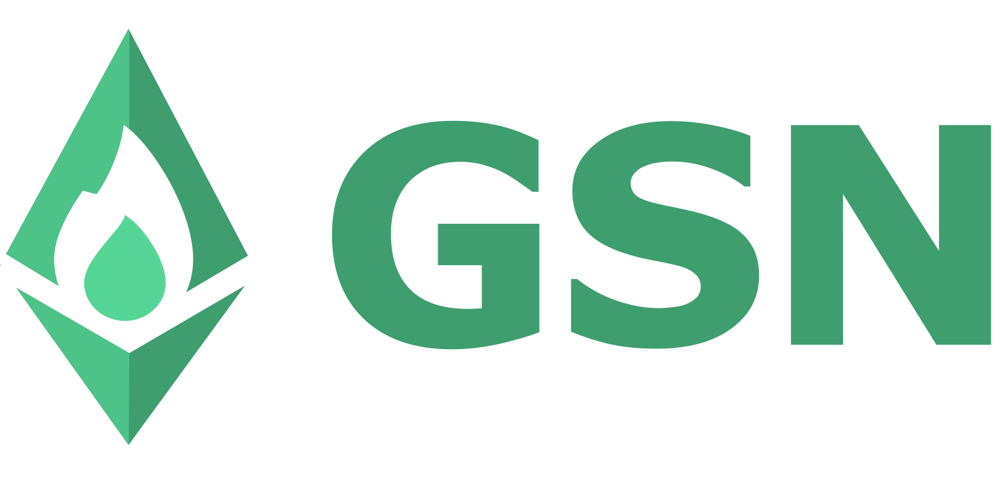

### Overview

#### What is GSN Web Tool?

#### What is GSN?
[GSN](https://opengsn.org/) is a distributed network of transaction relayers that allows decentralized
applications (daps) to abstract away the process of paying the transaction gas fees to minimize friction during
new user onboarding and to improve the user experience. With GSN, gasless clients can interact with Ethereum contracts
without users needing to own or spend ETH for transaction fees.

#### Build with

- [![React][React.js]][react-url]
- [![TypeScript][TypeScript]][TypeScript-url]

### Installation

1. `git clone https://github.com/opengsn/gsn-web-tool` - clone this repo
2. `yarn` - install dependencies

#### NPM scripts

For working locally you'll need to run a local blockchain, run a local GSN network and a local relay-server
Lucky - this project include yarn scripts which makes it easy. they should be run in the following order:

1. `yarn run local-hardhat-node` - run [Hardhat](https://www.npmjs.com/package/hardhat) locally. Hardhat is an Ethereum development environment for professionals.
2. `yarn run local-gsn`: run a local GSN
3. on windows - `yarn run local-remove-cache` - remove local cache
4. `yarn run local-relay-server`: run a local relay server
5. `yarn start` - react dev server

#### Install meta mask

Meta mask is a digital crypto wallet with support for local blockchain development environment

Steps:

1. install from https://metamask.io/download/
2. click on select network dropdown
3. enable "show test network"
4. select local network (localhost:8545), change chain id from 1337 to 31337
5. add test ether - take private key from `local-hardhat-node` terminal

This project was bootstrapped with [Create React App](https://github.com/facebook/create-react-app).

### Available Scripts

In the project directory, you can run:

#### `yarn start`

Runs the app in the development mode.\
Open [http://localhost:3000](http://localhost:3000) to view it in your browser.

The page will reload when you make changes.\
You may also see any lint errors in the console.

#### `yarn run build`

Builds the app for production to the `build` folder.\
It correctly bundles React in production mode and optimizes the build for the best performance.

The build is minified and the filenames include the hashes.\
Your app is ready to be deployed!

See the section about [deployment](https://facebook.github.io/create-react-app/docs/deployment) for more information.

[React.js]: https://img.shields.io/badge/React-20232A?style=for-the-badge&logo=react&logoColor=61DAFB
[React-url]: https://reactjs.org/
[TypeScript]: https://img.shields.io/badge/TypeScript-007ACC?style=for-the-badge&logo=typescript&logoColor=white
[TypeScript-url]: https://www.typescriptlang.org/
